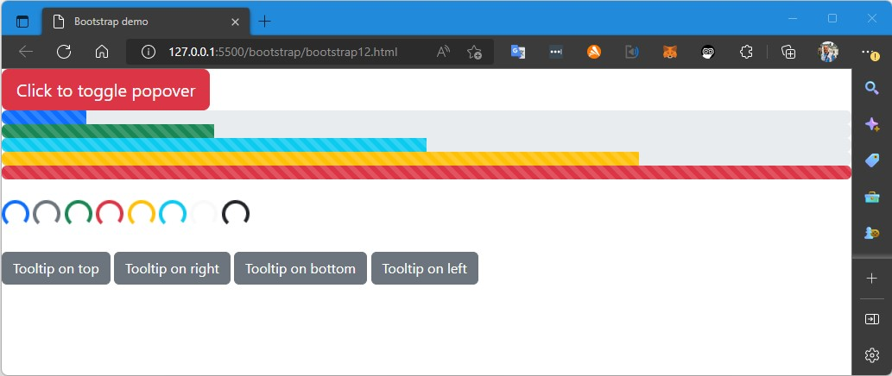

# Patika.dev - Frontend Eğitimi
Bu repo içeriğinde **[Patika.dev](https://www.patika.dev/)** FrontEnd eğitimi kapsamında yapılan **Bootstrap** çalışmaları bulunuyor.\
**[Örnek Çalışma 1](/bootstrap/bootstrap1.html)**
 
  
 
**[Örnek Çalışma 2](/bootstrap/bootstrap2.html)**
 
Bu örnekte farklı ekran boyutlarında değişen başlıklar görünüyor.
  
  
  
  
  
 
**[Örnek Çalışma 3](/bootstrap/bootstrap3.html)**
 
Bu örnekte **[Kodluyoruz](https://kodluyoruz.org)** ana sayfasının bir bölüöünün klonu yapılmaya çalışıldı.
  
 
**[Örnek Çalışma 4](/bootstrap/bootstrap4.html)**
 
Bu örnekte Normal sayfadaki maddelerin, mobil sayfada ters sıralanması gösterildi 
  
  
 
**[Örnek Çalışma 5](/bootstrap/bootstrap5.html)**
 
Bu örnekte Normal sayfadaki maddelerin, mobil sayfada ters sıralanması gösterildi 
  
  
 
**[Örnek Çalışma 6](/bootstrap/bootstrap6.html)**
 
Bu örnekte Normal sayfadaki maddelerin, mobil sayfada kategori başlığının en alta sıralanması gösterildi 
  
  
 
**[Örnek Çalışma 7](/bootstrap/bootstrap7.html)**
 
Bu örnekte akordiyon şekilinde bir menünü açılınca diğer menülerin kapatılması gösterildi 
  
  
 
**[Örnek Çalışma 8](/bootstrap/bootstrap8.html)**
 
Bu örnekte alert görünümü gösterildi 
  
 
**[Örnek Çalışma 9](/bootstrap/bootstrap9.html)**
 
Bu örnekte badge ve breadcrumb görünümü gösterildi 
  
 
**[Örnek Çalışma 10](/bootstrap/bootstrap10.html)**
 
Bu örnekte button, buttongroup ve close button (çalışmadı) görünümü gösterildi 
  
 
**[Örnek Çalışma 11](/bootstrap/bootstrap11.html)**
 
Bu örnekte collapse, dropdown menu, navbar, pagination görünümü gösterildi 
  
 
**[Örnek Çalışma 12](/bootstrap/bootstrap12.html)**
 
Bu örnekte popover, progress, spinner, toast görünümü gösterildi 
  
 
**[Örnek Çalışma 13](/bootstrap/medium-clone.html)**
 
Medium clone çalışması 
  
 
<!-- @import "[TOC]" {cmd="toc" depthFrom=1 depthTo=6 orderedList=false} -->

**[Ödev 2](/bootstrap/odev2/index.html)**
 
Instagram clone çalışması 
  
 
