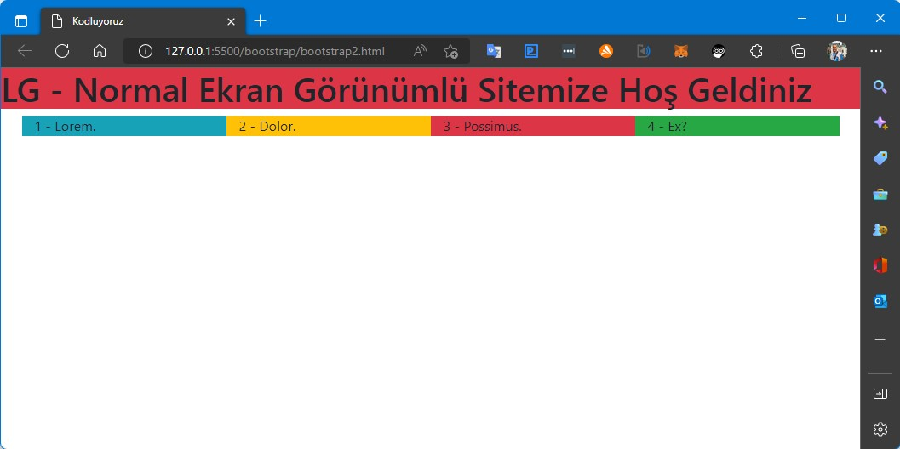
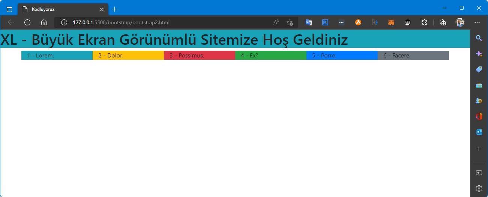

# Patika.dev - Frontend Eğitimi
Bu repo içeriğinde **[Patika.dev](https://www.patika.dev/)** FrontEnd eğitimi kapsamında yapılan **Bootstrap** çalışmaları bulunuyor.\
**[Örnek Çalışma 1](/bootstrap/bootstrap1.html)**
 
  
 
**[Örnek Çalışma 2](/bootstrap/bootstrap2.html)**
 
Bu örnekte farklı ekran boyutlarında değişen başlıklar görünüyor.
  
  
  
  
  
 
**[Örnek Çalışma 3](/bootstrap/bootstrap3.html)**
 
Bu örnekte **[Kodluyoruz](https://kodluyoruz.org)** ana sayfasının bir bölüöünün klonu yapılmaya çalışıldı.
  
 
**[Örnek Çalışma 4](/bootstrap/bootstrap4.html)**
 
Bu örnekte Normal sayfadaki maddelerin, mobil sayfada ters sıralnması gösterildi 
  
  
 